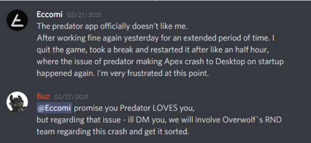
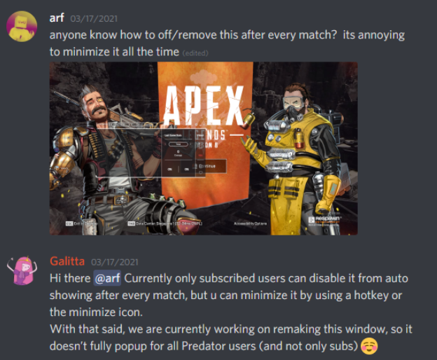

Today, gamers are proactive: They do their research, ask questions, and take control of their own journey. They can either be your #1 fan, or make it loud and clear that they are unhappy. It's no longer enough to just provide user satisfaction; you have a new mission, and it’s to create loyalty.
User support is a vital part of marketing and branding your app, and key in your journey to becoming legendary.

## Step 1 - Choose Your Platform

The platform you choose will play a critical role in setting up the main channel for engaging with your users. So no pressure.
The right platform for you is the one that will allow you to serve users in the most effective and consistent way. Before you choose, ask yourself these questions:

### A. What type of support do your users expect?

Gamers can be very demanding. What’s the best way to engage with them - Email? Discord? Are they comfortable using self-service tools? How fast do they expect to get an answer?

### B. What experience do you want to offer your users?

Do they need to submit a ticket with detailed information to get help, or can they fire off a question to get a quick response? 

### C. What issues are users likely to seek support about?

What are the questions users are going to ask? For example, in capture apps, the issues can get complex as there are many variables the app depends on (hardware, app settings, etc). This can also affect the length of the correspondence with a certain user.

## 

Once you have a clear vision of the best user support you would like to offer, it'll be easier to make a decision. From our experience, we recommend focusing on a platform that gamers are familiar with.
Discord and emails are used by gamers frequently and could provide an easy, free-to-use solution.

|               |      Discord                  |  Email                       |
|---------------|:-----------------------------:|-----------------------------:|
| Language      | “Dirty”, fast, non apologetic | Formal, polite               |
| Length        | Short, concise                | Long, detailed and informed  |
| Ideal queries | Can be solved easily          | Complex, requires extra info |
| Response time | Response tim                  | Can take up to a few days    |

A great way to illustrate this is with Predator’s Discord server.
Boaz Harel (Buz), the co-founder of Predator, replied to a user on the support channel with the following answer -  keeping it super cool and casual:

## Step 2 - Create a Unique Support Experience

When support is truly legendary, a user ends their support experience fully satisfied, and even recommends your app to their friends.
Hopefully, they might even tweet about it.
Communication changes from platform to platform, as mentioned above. And still, no matter which one you choose, make sure you aim to be legendary. 

### 1. Nail your first impression

With every new encounter, you are evaluated and yet another person's impression of you is formed.
* Make sure your profile is set: Full name/nickname, profile picture, signature.
* Mention your role in the app. You can easily do that in Discord under status, or in your email signature (e.g., Developers Community Manager at Overwolf). 
* Greet the user with their name (“Hey Gal”). If the platform uses a tagging system (@), tag the user to notify them.

### 2. Gather as much information as you can

If you own a live app, you’ve probably heard this a hundred times - “The app isn’t working”.
Sometimes users will have a hard time explaining the issue they’re having. It’s your job to help them by asking the right questions, leading them to the best solution as quickly as possible. Try to guide them through by asking: “Could you tell me what are the exact steps that caused the app to crash?”, or be more direct: “After you opened the app, where did you click?”.

### 3. Finish on a positive note

Whether you’ve figured out the issue or not, the user will remember you and their support experience. This will be reflected in how they perceive your app, and will then be translated into your app's retention.
Sign off with a sentence that leads to continuous engagement in the future. Something like: “Let me know if that worked", or “Is there anything else I can help you with?”. You can even refer them to your Discord community to engage with other community members for support. 

To demonstrate the ideal reply, Galit Steinberg (Galitta), the co-founder of Predator, answered to an annoyed user with this empathic answer:

## Step 3 - Add a Knowledge base

A help center is the ult for your app; It builds overtime, and when finally used - it can level you up from being a good player to an awesome one. It’s the text, pictures and videos that give your users the knowledge right when they need it the most.
To read more about how to build one click [here](add-a-knowledge-base-to-app).
