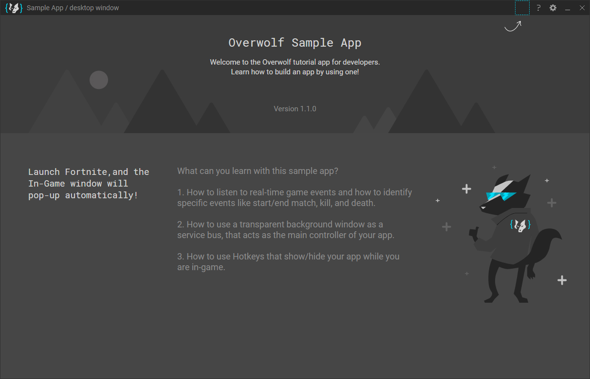
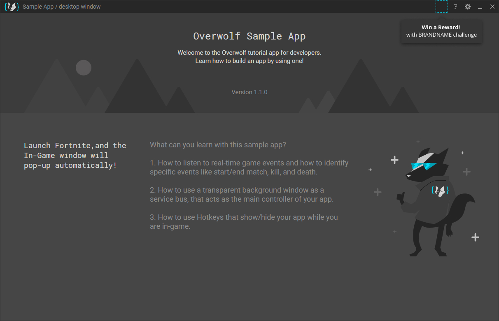

## How to integrate with AR
Full API Documentation found here: [overwolf-campaigns-crossapp](../api/overwolf-campaigns-crossapp)

### Step 1
When your app starts up - it should call the `overwolf.campaigns.crossapp.getAvailableActions` - and check if there is an existing action available. The result might look like this:
```
{
  actions: [{
    id: ‘XXXXXXXXXXXXXXXX’,
    action: ‘ar-invite’,
    expiration: 1600094829004,
    owner_app_uid: ‘cmhjmacifnhhboffmobjofpejedkbnfolcgijhpc’,
    data: {
      name: ‘BrandName Challenge’,
      iconUrl: 'overwolf-extension://hadnijlcbloooh...gefci/assets/images/icon.svg',
      title: ‘Win a Reward!’,
      titleColor: ‘#FFF000
      text: ‘with the Brandname Challenge’
      textColor: ‘#FFFFFF’
    }
  }]
}
```

### Step 2
Your app should also register to the: `overwolf.campaigns.crossapp.onAvailableActionUpdated` event, in case an AR campaign becomes available while your app is still running (or becomes unavailable).
An expired campaign will have the value `“expired”:true` in its callback

The Overwolf API allows you to include some info in the OW app store’s download link. You can use this feature for different purposes, however, the most common one is to add a unique referral ID to track your download link. This ID allows you to track installations and know exactly which users came from which channel.

You can also allow your users to create shareable download links for their friends, and track how many friends each user has recruited for reward purposes.

### Step 3
The interesting fields of a campaign action are:

* ***id*** - the campaign id (used when calling overwolf.campaigns.crossapp.reportConversion)
* ***action*** - used to identify that this is an Achievement Rewards Invite action
* ***owner_app_uid*** - used to verify this is coming from the Achievement Rewards app
* ***iconUrl*** - used to display the invite image in your app
* ***title*** - used to display a text stating the reward in the tooltip, The title should be displayed in BOLD
* ***titleColor*** - used as the color of the title
* ***text*** - used to display a text stating the campaign name in the tooltip
* ***textColor*** - used as the color of the text

### Step 4
If there is such campaign, Use the iconUrl to display the invitation button - once clicked - the app should call: 
```
overwolf.campaigns.crossapp.reportConversion({
    id: ‘XXXXXXXXXXXXXXXX’,
    data: {},
    owner_app_uid: ‘cmhjmacifnhhboffmobjofpejedkbnfolcgijhpc’
},console.log);
```
:::important
**The empty data object - please keep this**
The actual owner_app_uid is: `‘cmhjmacifnhhboffmobjofpejedkbnfolcgijhpc’`
:::

### Step 5
At this point, the Achievement Rewards app will open a window and the user can register for the campaign.

### Step 6
***A.*** The icon container by default shall be transparent and not contain any static images in it - the assets will be provided via the API according to the relevant campaign in an .svg format, if for some reason there has been an error getting the icon the container shall remain empty and not show any meta data or broken image placeholder.

***B.*** The tooltip shall be permanently open and visible on first lunch of the app with the AR version until a user has clicked on the icon and the AR app opened, once the user has clicked the icon and opened the AR (this is where he has passed the learning curve on how to access it) the tooltip shall reset to open on hover only.

***C.*** The API handles everything that has to do with the campaigns including, geolocation, campaign ID, icon assets and tooltip texts and colots per campaign - this is made to create an environment where it can support multiple campaigns now and in the future without any additional development.


## How to implement the UI
**TOP BAR ICON CONTAINER POSITION** - The icon container shall be the last item on the top bar from right to left. The icon container shall have the same gap as the rest of the top bar icons have. so for example, if on the top bar there is a 6px gap from each top bar icon, the icon container will inherit the same behavior

:::important
The icon container size shall be 30x30 pixels
:::



### TOOLTIP


**TOOLTIP POSITION AND BEHAVIOR** - here, you can find examples of how the tooltip positions should look like.

:::important
The tooltip shall appear on first launch until the user has clicked the icon for the first time and has launched the AR Challenge app.
:::

`EXAMPLE: Center alignment tooltip position`


`EXAMPLE: Right alignment tooltip position`

