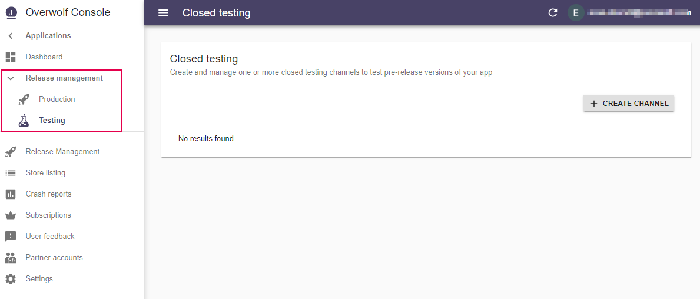
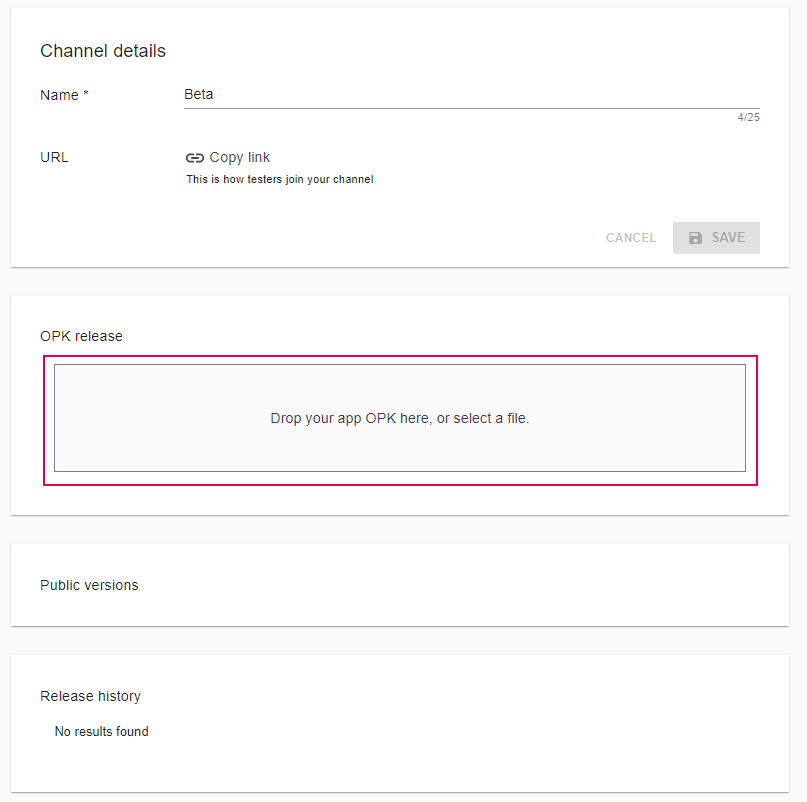
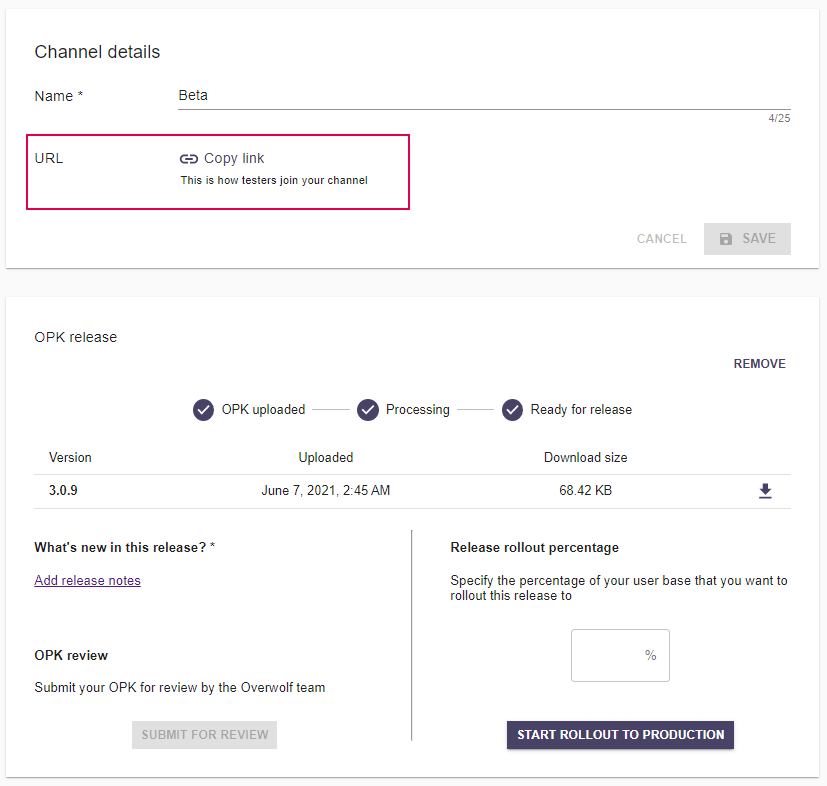
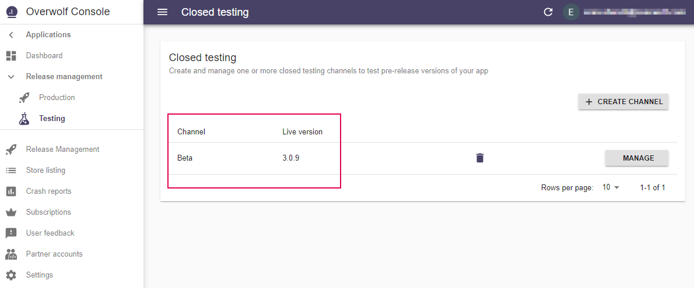

This article will explain what App Channels are and how to create a new app channel using the Overwolf developer's console.

## What are App Channels

Channels are no longer exclusive to the Overwolf client, and your app can now also have channels; You can set a specific channel to use a particular version. This way, you can super easily create and distribute beta versions for your app.

## The "Production" and "Testing" Environments

Until now, you worked with a single release environment: the "Production". This environment stores your latest public version of your app (and previous versions), enabling you to release easily and quickly updates and new versions to your users and even release "downgrades" for previous versions.

In addition to the "Production" environment, you have the "Testing". This environment enables you to create multiple "version channels."  Each channel is bound to a different app version and gets a separate download link and release management system.  With this setup, you can quickly release updates, fixes, and new versions for this specific channel. 

For example, if one of your testers installed the "beta" channel version of your app, using the unique link that you supplied - you can get a list of bugs from him, fix them, and quickly distribute an improved version for your "beta" channel users.

When your app is ready to deploy - you can release the version to the production release environment and phase it to your entire public user base.

## How to create a new App Channel

As mentioned above, you can easily create multiple app channels for your app through your dev console.

### 1. Create a new app channel

You can see the default `Production` release environment in the screenshot, where you can [deploy public version](submit-a-new-version#upload-new-app-version). Under it, you can see the `Testing` environment where you can deploy custom and beta versions of your app:



Currently, there are no custom app channels for this app. Let's create one. Click on the "Create Channel" button.

The app channel creation modal will popup, and we will create an app channel named "Beta", for our testers team:


Now you can see that a new app channel is created, still, without any app that uploaded and released to this new channel:


### 2. Upload an OPK to the channel

Precisely like you [submit a new version of your app](submit-a-new-version#3-upload-the-new-opk), you need to upload an OPk to the new channel (on our case, a beta version of your app with unreleased features that need to be tested). And distribute/phase it to the app channel subscribers.

Click the "Manage" button of the new channel (in our example, the "Beta" channel):


Now you can see the good old OPK release page, where you can phase and release different app versions for this particular channel. Remember - that only the latest version is the "public" version distributed to the app channel subscribers whenever the app will get updated.



### 3. Get the download link

After uploading the OPK to the custom channel, you get get a custom link for downloading this specific app channel "flavor":



After releasing a version to your new channel, you can go back to the channels list page and see which version is the "public" version of each channel. In our case, v3.0.9 is the released/public version of the "Beta" channel:



## Download a custom channel version

There are two ways that your testers/users can get the custom app version from a speicif channel:

1. **Custom download link** - Get the custom download link from the dev console as [explained above](#3-get-the-download-link).  
  After creating a new channel and upload an app version into it, a custom download link is generated automatically. Clicking on it will download an EXE file which is the latest OW client bound to your app. Exactly like the download links from the store.

2. **API** - Use the API as [explained below](#the-app-channels-api) to change the current app channel, enabling you to integrate this feature in your app. For example, display a combo box that enables your app users to change the channel from the app's UI.

## Apply the channel change

After downloading the custom app version or changing the app channel, you will have to do ONE of the following to apply the change:

1. Restart OW client.
2. Wait up to four hours for the auto-update process to initiate.
3. Update the app through the API and relaunch it, using the recommended [extension update flow](../api/overwolf-extensions#recommended-extension-update-flow).


## The App Channels API

You can implement the channels feature directly in your app using the app channels API. 

You can read the current installed channel of your app using [overwolf.settings.getExtensionSettings()](../api/overwolf-settings#getextensionsettingscallback) (and display it in your app's UI for example).

```js
overwolf.settings.getExtensionSettings() //{"settings":{"channel":"beta"},"success":true}
```

You can change the current channel using [overwolf.settings.setExtensionSettings](../api/overwolf-settings#setextensionsettingsextensionsettings-callback) (and enale your app users to change thier app version for example).

```js
overwolf.settings.setExtensionSettings({ channel: "beta" })
```

## App Channels Sample App

You can download our [App Channels sample app]() that demonstrates how to use the app channels feature and API.

* link will be available soon.
