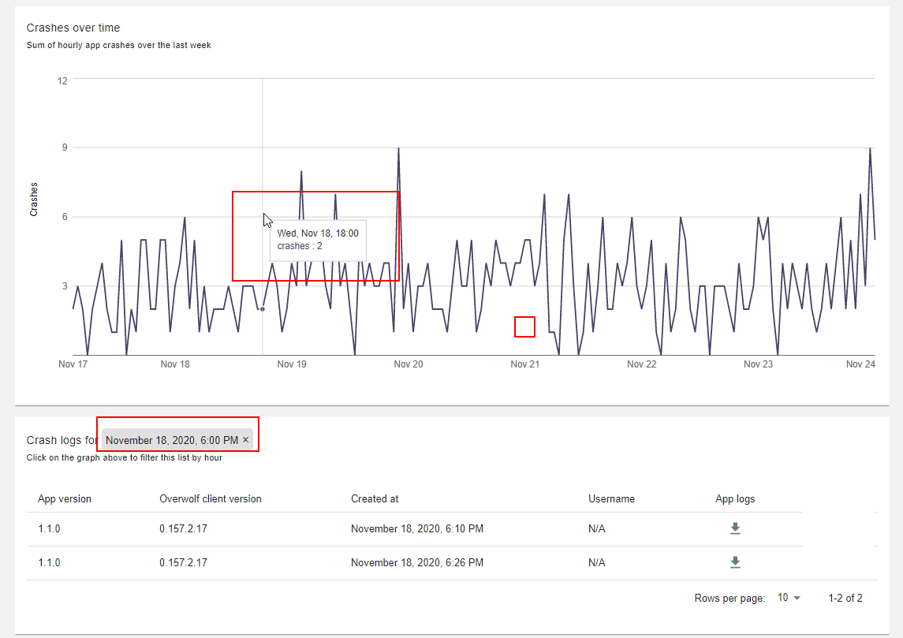

In this article, we'll go over the process of viewing the crash reports for your apps, and understand the different types of reports.

:::important
This report is currently down for maintenance / not available.
:::

## Overview

Whenever your app crashes unexpectedly, the crash logs are automatically uploaded to our servers by the OW client. If there is no available internet connection or any other reason preventing the client from uploading the crash logs, it will automatically try to upload the logs every several hours until success.

Each crash log is a zip file that contains all your app's crash logs, named according to the app's windows names, e.g.:  
background.html.log, background.html.1.log, ads.html.log, ads.html.1.log, ads.html.2.log, etc.

Once the logs are collected by our servers, you can view and analyze them through the OW dev console.

## Crash reports types

There are several types of views available for your app's crash logs, to make it easier to find and filter them. 

### Crashes over time

### Crash logs

For each crash incident, you can get various details:

* App version
* Overwolf client version
* Time created
* Username
* App logs

### Filter crashes by hour

If you would like to get crash logs for a specific timeframe, you can filter by the hour:

### Download crash logs

For each crash, you can easily download the user's support package uploaded to our servers - to examine, analyze, and find errors and issues. Just hit the gray arrow next to the relevant crash: 

### Crash rate compared to peers

You can view your crash rate compared to similar apps and determine if your app's health quality is relatively stable or not.

