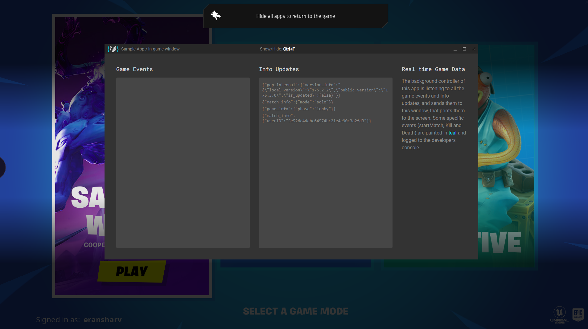

Overwolf apps are supported in many games. Each one behaves in its own unique way, and requires to be treated differently.

In games which have a state without a mouse cursor (usually FPS), we’ll need to provide users a way to activate the Overwolf app, and a way to control and interact with the app’s window.

One way to do so is by changing Overwolf’s overlay options to exclusive mode. In this article we’re going to explain how to activate it, and how to detect and deal with cases that can disable it (e.g, full screen without borders setting).

## What is exclusive mode

As mentioned above, in FPS games such as CSGO, World of Tanks, Fortnite, Warzone and more - there’s no mouse cursor. The user can't control the Overwolf app window. The only way to interact with the OW apps window is to set the app window into "exclusive mode" – the game window becomes semi-transparent, input doesn't pass to the game, and a cursor interacts with the OW app available.

## How to enable exclusive mode

There are two options to enable the exclusive mode while you are in a game:

### Ctrl + Tab

Hitting Ctrl + tab while you are in a game set OW in exclusive mode - the game window get semi-transparent background, the OW dock is shown, and you can interact with your OW app's windows (if any windows are open).  

Hitting ctrl+tab again or clicking outside of the OW app's window will "release" the exclusive mode.

### Using Hotkey

If you have a window that is bundled to a hotkey, and you want to enter into an exclusive mode when the hotkey is fired, you should:

* Set the flag [focus_game_takeover](../api/manifest-json#focus_game_takeover) to `ReleaseOnHidden`.
* Set the [focus_game_takeover_release_hotkey](../api/manifest-json#focus_game_takeover_release_hotkey) to the hotkey name. 

When the hotkey is fired, the window will show up and enter exclusive mode (enabling user interaction and accepting input from the user). When the hotkey is clicked again - the window will hide and exit the exclusive mode.

In the above screenshot, you can see that the background is semi-transparent, and at the top of the screen a notification that guides the user which hotkey release the exclusive mode: "Ctrl + F to hide this app and return to the game". Of course, the key combination will change according to the current hotkey.

### Automatically on window launch

If you have a window that displayed automatically (a startup window, for example) and you want to enter exclusive mode automatically when the window is shown, you should:

* Set the flag [focus_game_takeover](../api/manifest-json#focus_game_takeover) to `ReleaseOnLostFocus`.

When the window is launched, it automatically enters exclusive mode (and enables user interaction and accepts input from the user).
Once the user clicks outside the window, the window will exit the exclusive mode.

In the above screenshot, you can see at the top of the screen a general notification that guides the user "hide all apps to return to the game".

## Special Overlays

Several specific "mouse-less" games: CSGO, Warzone, and Destiny 2, have some additional limitations in addition to the exclusive that is required to interact with the OW windows: 

* When one of these games is running in non-borderless fullscreen mode (other modes are fullscreen borderless and windowed mode), the exclusive mode is completely disabled, and there's no option to interact with your app's window at all.  The only thing that you can do is to notify the user and ask them to change game mode to fullscreen borderless or windowed mode.  
  **To detect if the game is running in non-borderless fullscreen, read the [overwolf.games.OverlayInfo.exclusiveModeDisabled](../api/overwolf-games#overlayinfo-object) property. If it's `true`, it means that the exclusive mode is disabled, and you should display the user notification about it.** (suggest him to change the mode to fullscreen borderless or windowed mode. Otherwise he will not be able to interact with your app's windows )

* Overwolf allowed capturing these games only when it's in fullscreen-borderless mode. If the game is in fullscreen non-borderless or windowed mode (we'll support it also very soon), the capture will not work correctly.
