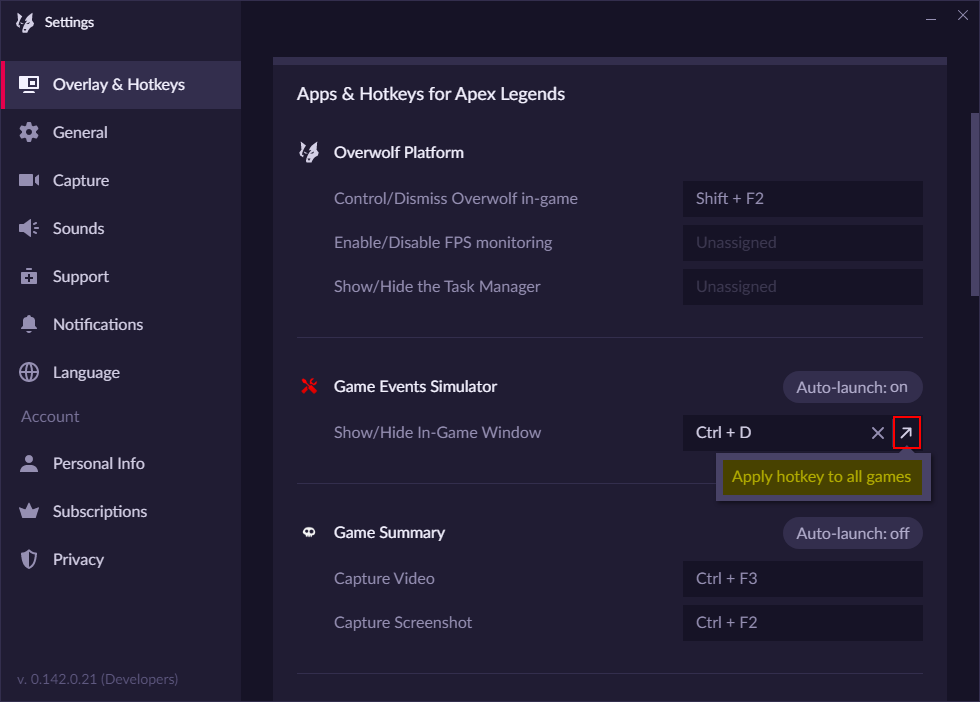

## Using Hotkeys

Hotkeys are set in the manifest file, under the [hotKeys section](../api/manifest-json#hotkeys-object).

:::important
Hotkeys will only work in-game, not on desktop.
:::

An example of a hotkeys section from the manifest:

```json
"hotkeys": {
    "show_YourAppName": {  //hotkey #1 name identifier
        "title": "Show Player", //hotkey title
        "action-type": "custom",//toggle or custom
        "default": "Shift+F9", //key combination
        "passthrough": true, //pass the keys to the game or not
        "hold": true //invoke the action only while it's being held
    },
    "save_YourAppName": { //hotkey #2 name identifier
        "title": "Save Replay for later",
        "action-type": "custom",
        "default": "Ctrl+Shift+F9"
    }
}
```

## Types of hotkeys

There are two types of Hotkeys we use:

### Toggle

A special hotkey that toggles the application visibility by showing or hiding it.  
**Few apps are using it, as it's the only action that it can do.**

* The advantage is that a toggle hotkey can activate your app even if it's closed, and launches your in-game app window.
* Another advantage is that you don't have to register for any event. Just define the hotkey as "toggle" in the manifest.

:::important
If you are using a transparent background controller (window), a toggle hotkey will not work properly. Please use a [custom hotkey](#custom).
:::

### Custom Hotkeys

Defines a custom hotkey to be used by the app.  
Most apps are using this kind of hotkey, as it can activate any action and you can customize your app's window behavior.

* Custom hotkeys will only function when your app is already running (Unlike Toggle hotkeys, using a custom hotkey with the app closed will do nothing).
* Custom hotkeys will only function and get a response from your app after registering the hotkey using the [overwolf.settings.hotkeys.onPressed](../api/overwolf-settings-hotkeys#onpressed) event.
* If you are using a [hold](#hold-hotkeys) type hotkey, you should register to the [overwolf.settings.hotkeys.onHold](../api/overwolf-settings-hotkeys#onhold) event, instead of the [onPressed](../api/overwolf-settings-hotkeys#onhold) event.

:::important
If you are using a transparent background controller (window), register your app's hotkeys to the **onPressed** event, in that window.
:::

## "Hold" hotkeys

You can set a hotkey as a "hold" hotkey: a hotkey that functions while pressed down and stops when released, usually used for "ShowOnHold" mode (like the tab key does in some games).

To implement a hotkey which works with a "ShowOnHold" functionality, you should set it as a "hold" hotkey in the manifest, and register to the [overwolf.settings.hotkeys.onHold](../api/overwolf-settings-hotkeys#onhold) event.

You can read a detailed example on how to do that [here](using-tab#set-the-hotkey-in-the-manifest).  
This example demonstrates how to set the Tab key as a "hold" hotkey, but of course, you can set any other key as a "hold" hotkey in the same way.  

## Global Hotkeys

For apps that work in more than one game or global apps there is an option to set hotkeys as global hotkeys.  
This option is available from the OW client UI or using the [API](../api/overwolf-settings-hotkeys#assignhotkey-callback).

A screenshot from the OW client UI:



If you "upgrade" your hotkey to a global hotkey, the OW client will try to set this hotkey for all installed games on your machine.

Whenever hotkeys are added this way but a conflict exists, the hotkey is added as unassigned.

You can get the list of all your app's assigned hotkeys using the [overwolf.settings.hotkeys.get()](../api/overwolf-settings-hotkeys#getcallback).

## Get notified on a Hotkey change

Listen to the [overwolf.settings.hotkeys.onChanged](../api/overwolf-settings-hotkeys#onchanged) event if you want to get notified when users change your app's hotkeys from the OW client settings page.

## Reassign Hotkeys

It is possible to reassign hotkeys directly from apps, or, through the Overwolf client settings page.

What you can do is place a direct link to the relevant settings page, into the hotkeys of a specific game settings, using:

`overwolf://settings/games-overlay?hotkey=hotkey_name_in_manifest&gameId=game_id`

Or, you can use the [overwolf.settings.hotkeys.assing()](../api/overwolf-settings-hotkeys#assignhotkey-callback) and [unassign()](../api/overwolf-settings-hotkeys#unassignhotkey-callback) APIs.

> It's possible to even use left or right arrows for hotkeys. To do so, you should use the code `Left` or `Right` in your manifest.json.

## Pass through 

You can set a hotkey as "passthrough," which means that the hotkey will not interfere with keys from the game.  
The key combination will trigger your app hotkey and then will "passthrough" the game.

Example code from the manifest, for a hotkey that set to pass through:

```json
"hotkeys": {
    "show_YourAppName": { 
        "title": "Show Player",
        "action-type": "custom",
        "default": "Shift+F9",
        "passthrough": true,
    },
}
```

## Uninstall

All app hotkeys removed once the extension is uninstalled.
