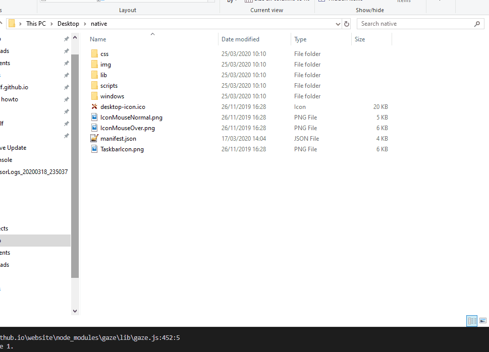
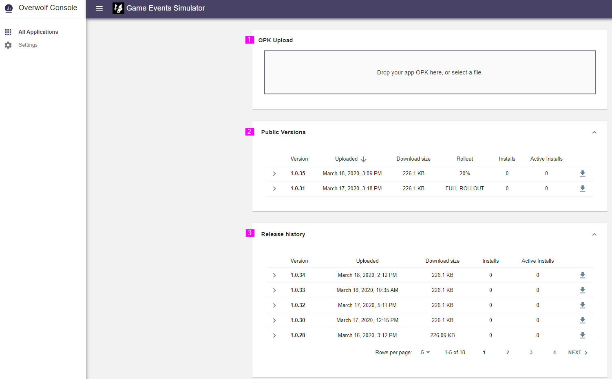
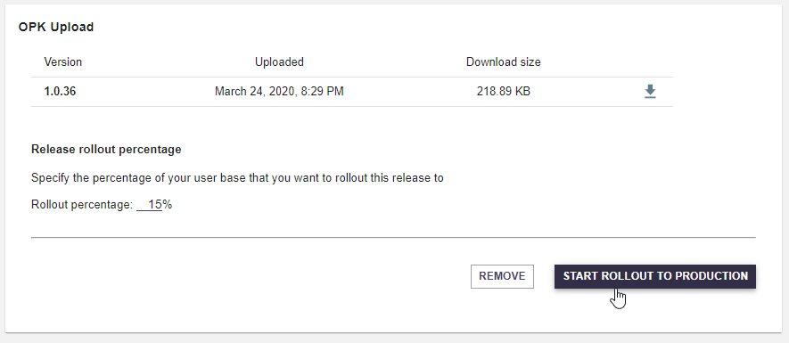
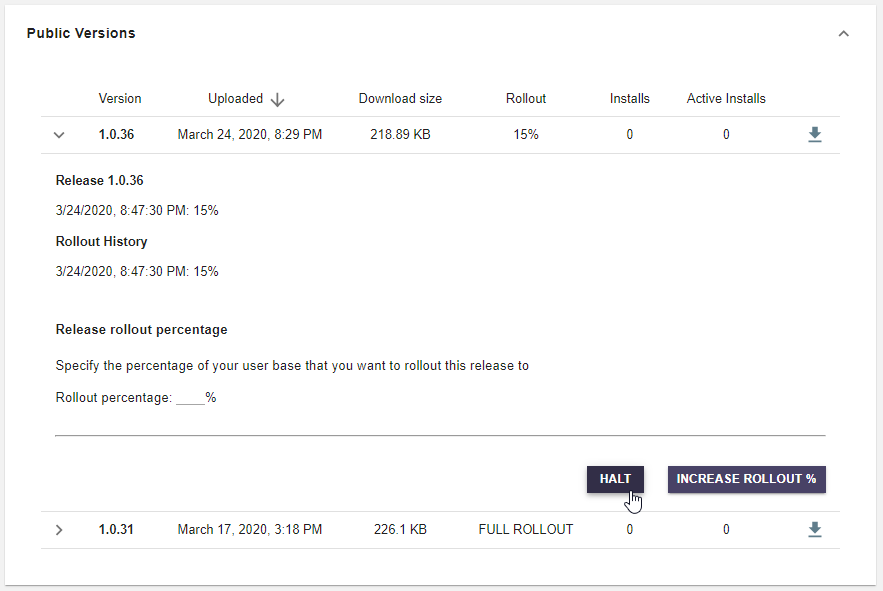

Alright, so your app is published on the Overwolf Appstore, and it's time to release a new version. That's awesome!  
In this article we'll go over the process of submitting an updated version of your app using the Overwolf developers console.

:::note
The process described in this article is only available for apps already published on the Overwolf app store. If you’re looking for guidance on publishing your very first app version, you’re in the wrong place - [try this article](../start/submit-your-app-to-the-store) instead.
:::

## Upload new app version

Don't forget to update your manifest [build version](../api/manifest-json#meta-object), once the version has been changed.

### 1. Create an OPK package

To get started, you first need an OPK file with the latest version you wish to upload.

OPK files are Overwolf's app installation package, which includes your app's files: the manifest, source files, and other assets. All files are packed in a package that has the OPK file extension.

To create it, ZIP all your files together, then manually change the file extension from ZIP to OPK.

Make sure to have all the following items in this structure:

<pre>
+---- manifest.json
+---- IconMouseNormal.png
+---- IconMouseOver.png
+---- launcher_icon.ico
+---- WindowIcon.png
+---- index.html
+---- Files
+---- css
+---- assets
</pre>

Double-clicking an OPK will install the package.

**Make sure to pack the manifest and all the files and folder in the root of the package, like this:** 

More info about the OPK structure can be found [here](../start/submit-your-app-to-the-store#how-to-submit-an-app).

### 2. Login to the developers console

Once you have a valid OPK with the latest version, to get the update cycle started, upload the new version to [OW developers console](https://console.overwolf.com/).

From the developers console you can:

1. Choose an OPK and upload it.
2. See which versions are public and live, and their rollout status.
3. See the release history of previous versions.

### 3. Upload the new OPK

Drag your OPK to upload it. Once it's ready, you can set the rollout percentage.

### 4. Set the phasing rate

After uploading a new version of your app, you can choose the phasing (rollout) rate - meaning what percentage of your app's users will get this new version.

We highly recommend starting with a low phasing rate (like 15%), to get some feedback on compatibility issues, bug reports and other issues that you might have missed in your QA process.

### 5. Increase or Halt the phasing rate

After the new version was rolled out to production and is working as expected, you can gradually increase the phasing rate until it reaches %100 - meaning all of your users got the new version.

If you find any issues, you can immediately halt the rollout.

## Release history

You can easily view the release history of all the previous versions:

