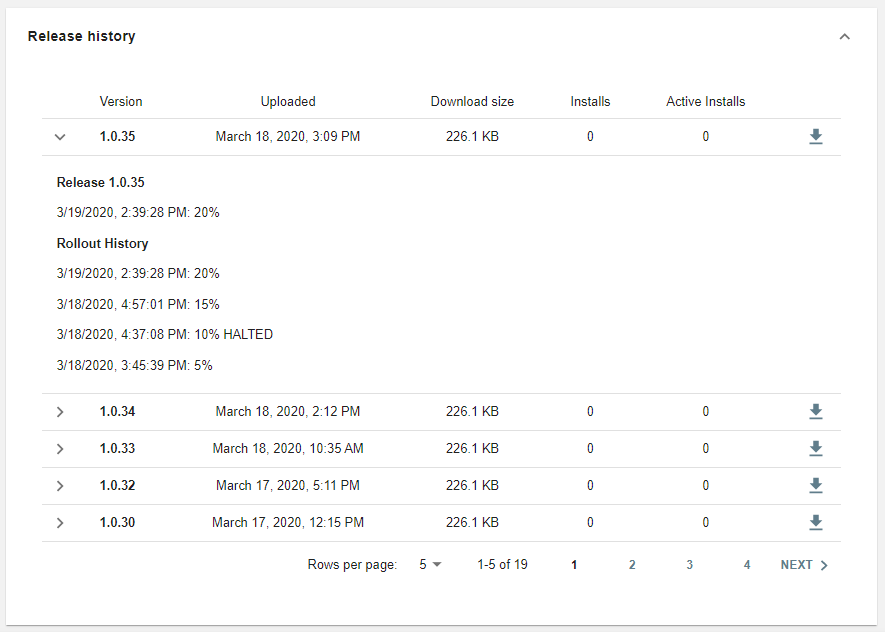

Your app is available on the Overwolf Appstore and it's time to release new features you've been working on. That’s awesome! In this article we'll go over the process of submitting updated version of your app using the new OW developers console.  

**Don't forget to update your manifest [build version](../api/manifest-json#meta-object)**, once the version has been changed.

## Upload new app version

The following steps are describing how to upload a new version of an existing app that already exists in the OW app store.  
If your app has never been uploaded to the OW app store, please contact us, as currently, the initial upload cannot be done through the developers console.  
Soon, we will add this feature, as long as other features like asset management, etc.

### 1. Create an OPK package

OPK files are Overwolf's app installation package which includes your app's files: the manifest, source files and other assets. All files are packed in a package which has the OPK file extension.

To create it, just ZIP all your files together, then manually change the file extension from ZIP to OPK.  
Make sure to have all the following items in this structure:

<pre>
app folder
    +---- manifest.json
    +---- IconMouseNormal.png
    +---- IconMouseOver.png
    +---- launcher_icon.ico
    +---- WindowIcon.png
    +---- Files
        +---- index.html
        +---- css
        +---- assets
</pre>

Double clicking an OPK will install the package. 

More info about the OPK structure can be found [here](../start/submit-your-app-to-the-store#how-to-submit-an-app).

### 2. Login to the developers console

Once you have a valid OPK with the new version To get the update cycle started, upload the new version to [OW developers console](https://console.overwolf.com/).

1. Choose the OPK to upload.
2. See which version are public and live, and their rollout status.
3. Release history of previous versions.

### 3. Upload the new OPK

You can drag your OPK to upload it, and once it's ready, you can move to the next step - choose the rollout percentage. 

### 4. Set the phasing rate

After uploading a new version of your app, you can choose the phasing (rollout) rate, which means - which percentage of your app's users will get this version.

It's highly recommended to start with a low phasing rate, like %15, to get some feedback, bug reports, compatibility issues, and other issues that you might have missed in your QA process.

### 5. Increase or Halt the phasing rate

Once the new version started to roll out to production, and you are confirmed that it's working as expected, you can increase the phasing rate in several steps, till %100 of your users get the version.

If you find any issues, you can immediately halt the rollout.

## Release history

You can easily view the release history of all the previous versions:

