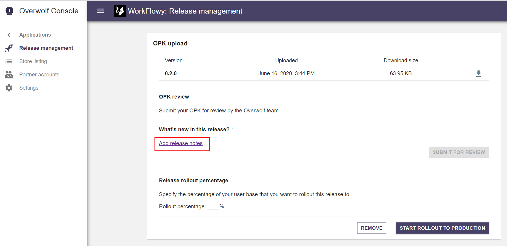
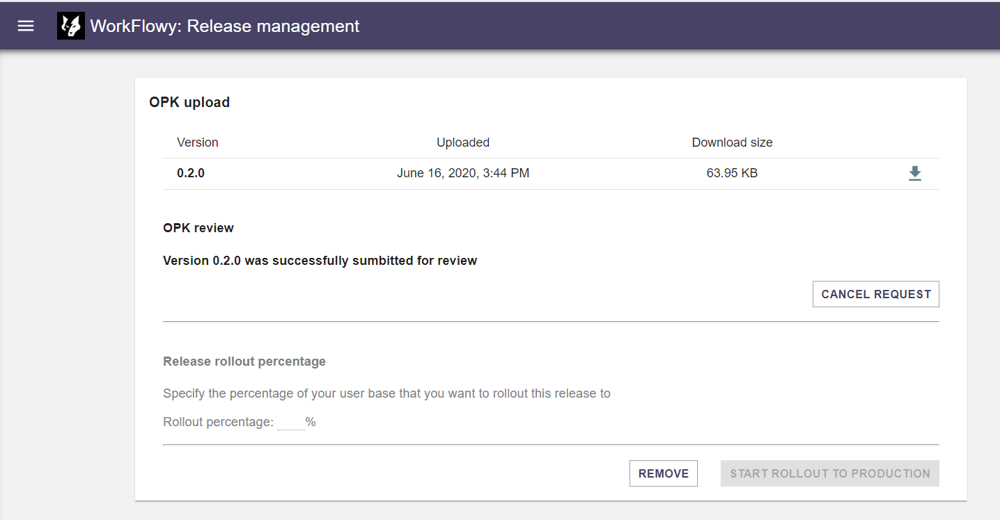
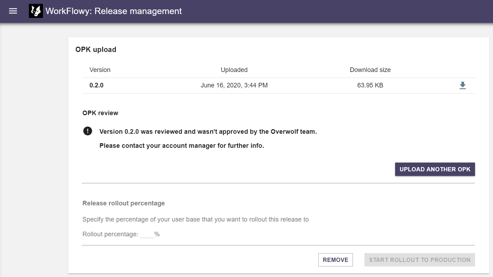

On the [previous guide](submit-a-new-version), we learned how to submit a new version of your app, using the Overwolf developers console.

In this article, we'll go over the process of submitting the updated version for an Overwolf QA review, before starting to [deploy](/submit-a-new-version#4-set-the-phasing-rate) the app to production.

## 1. Add release notes

After [uploading the new version](/submit-a-new-version#3-upload-the-new-opk) of the OPK, you need to add some release notes, that includes info about new version changes, new features to test and everything that you think might be useful for our QA team.

Once you click on the "Add release notes" button, a window will popup and you can add the release notes for this version (in markdown format).

:::note
These notes will not be displayed in your app as a changelog, cannot be fetched through the OW API, etc. It's just internal notes addressed to our QA team so they can focus on new features and changes.
:::

## 2. Submit for review

After you finish to update the release notes, the "submit for review" button will turn enabled.
Hitting submit will send it to our QA team and display the message: "Version X was successfully submitted for review".

Note that once your app is waiting for review, the deployment button on the right bottom ("start rollout to production") becomes disabled.

## 3. QA review results

Once the OW QA team reviewed your app, it can approve it or reject it.  
You will get a notification about the review result.

### Rejected

If our QA team rejected your app, you would be asked to contact your account manager for more info.  
In a future version of the dev console, we probably add the detailed review report directly in the dev console, but currently, once your app is rejected, the QA team will usually email you the report.

After you fix all the issues, you are welcome to upload another updated OPK.

### Approved

Once your app is approved, You can [set the phasing rate](submit-a-new-version#5-set-the-phasing-rate), and start rolling it out to production.

