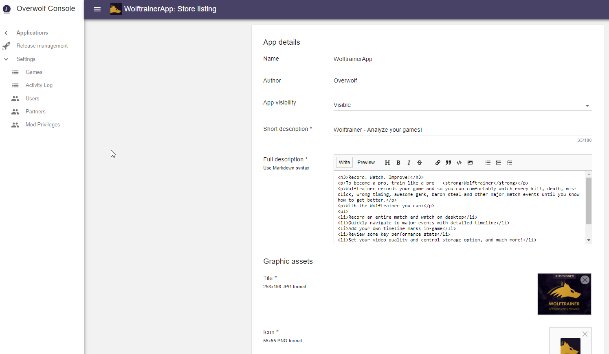

After your app is published on the Overwolf Appstore, you may update your store listing.  
In this article, we'll go over the process of updating your app store listing using the Overwolf developers console.

Note that the process described in this article is only available for apps already published on the Overwolf app store.

:::important Save your work
Once done, don't forget to click the **save** button on the bottom of the screen.  
Navigation to another tab or page, will cause the loss of any unsaved data.
:::

## Login to the developers console

After logging to the [OW developers console](#https://console.overwolf.com/) you can choose store listing:

## Update store listing

On the store listing screen, you can update all your app details that displayed in the store: name, screenshots, etc.
There are several read-only properties like name, author, and app visibility. Other than that, you can control all your store app's info through this page.

#### Note
If you followed our guide on how to [submit your app to the app store for the first time](https://overwolf.github.io/docs/start/submit-your-app-to-the-store#the-store-folder-should-contain), you should have a **store** folder containing all the texts and assets used in this article.

### Name and Author

Read-only properties: The extension UID is automatically generated from hashing the app name and the app author, on the first time that the app is uploaded to the store - and never changes on the app life cycle.  
If you want to edit one of these fields, contact us.

### App visibility

Read-only property: currently, only the OW team can change this property and make your app "invisible" in the store: 
Only users with a direct download link will be able to see your one-app page in the OW app store and download the app. 
Usually, we use this option during the pre-launch period for final tests.

### Short description

Short description (180 character limit) of your app. Only plain text no HTML or Markdown.

### Full description

Full description of your app. This description will appear when users click on your app's store tile.  
Support plain, Markdown, or HTML format (except H1 and H2 tags).

Note: you can use the content of the [description.html file from the "store" folde](../start/submit-your-app-to-the-store#4-descriptionhtml) that you used for uploading your app to the store for the first time.

### Tile

The Appstore tile asset for your app.  
* Should be a JPG format image sized 258X198 at 72PPI.
* Same as the [tile file](../start/submit-your-app-to-the-store#1-tilejpg) from the "store" folder.

### Icon 

This is the icon used to represent your app in the Overwolf appstore.  
* Please make sure your chosen icon looks great on both dark and bright backgrounds.
* Should be a PNG format image sized 55X55.
* Same as the [icon file](../start/submit-your-app-to-the-store#2-iconpng) from the "store" folder.

### Screenshots 

Include at least one screenshot of your app which will be shown in the app’s page when reached through the Appstore.
* Should be a JPG format image sized 656x410.
* Providing more than one attractive screenshots increases your app’s chances of getting noticed and winning hearts.
* You may include up to 5 screenshots per app. 
* Please choose screenshots that remain clear and where features can be spotted at this resolution.
* Same as the [ScreenshotX section](../start/submit-your-app-to-the-store#3-screenshotxjpg) from the "store" folder.

