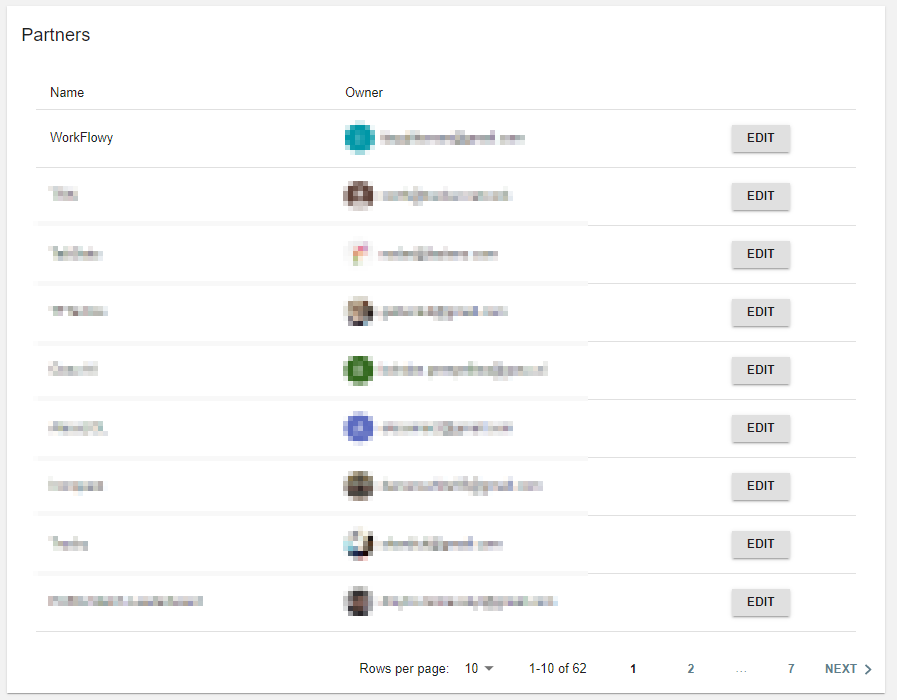
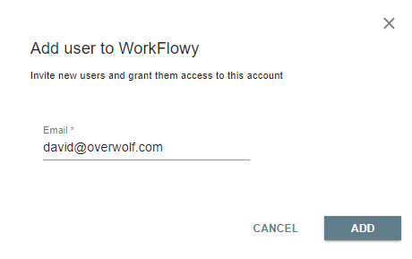
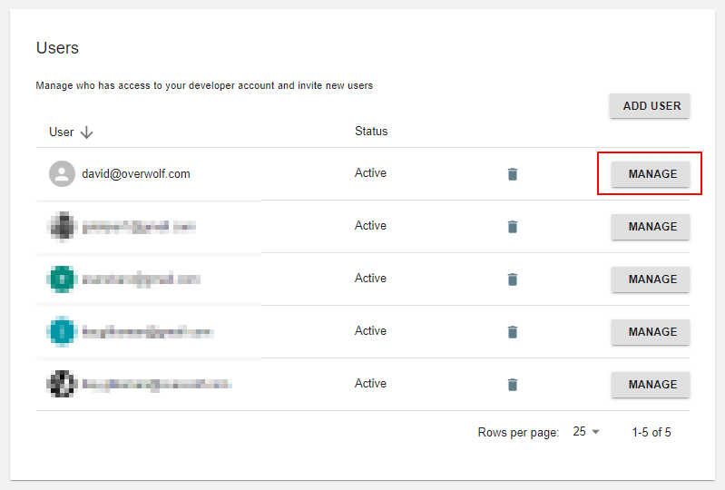
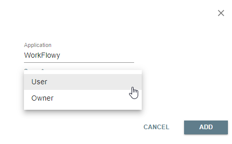
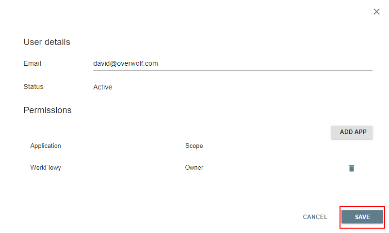

In this article, we'll go over the process of adding and updating users to your dev console account.  
These users can be your team member or others, that maintain your app, update your store listing, release managers, etc.  
For each user, you will be able to set different permissions and roles.

## Partners and Users overview

Before we begin, a few words about what a Partner is and the hierarchy and relation between Partners, Users, and Apps.

* The **Partner** entity represents a team or company.
* **User** can be part of many partners (teams), and partner can contain many users.
* A partner can own many **Apps**, but the app can be owned by one partner only.
* A user can be part or own many apps, and app can contain many users.

Now, after everything is clear and makes sense, let's start.

## Login to the developers console

After logging to the [Overwolf developers console](https://console.overwolf.com/), navigate to "Users and Permissions":

## Select partner

As you can see on the following screenshot, my user is part of many partners (teams). Note that it's not so common, as usually, you will be part of one partner.  

Let's edit the first partner and add users to it.

## Edit partner details

After selecting which partner you want to edit, you will get to the **Partner Details** page.

As the partner's owner, you can edit various properties like the name, primary owner, and associated apps. 

Assuming the current partner contains at least one app, let's add a new user and associate it with that app.

## Add new user

After clicking the "Add User" button, you will get this popup:

Enter the user's email, and hit "Add". 

## Manage user details

Now that we set the new user, we can associate it with one or more apps that "belong" to the current partner.  
In addition, for each app we can set the right permissions (role) for the user.  

Let's select it from the list and hit "Manage".

### Associate user with an app

After clicking the "Manage" button, you will get the user details page:

The first step is to associate the new user with an app. hit the the "Add App" button.

### Set the user's role for an app

After clicking the "Add App" button, you will get this popup:

You can choose one of the partner's apps and the user's role for that app's select box.  

A role is a set of permissions. Read more about roles [below](#roles-and-permissions). 

Repeat the process until you finish setting all the required permissions for all the partner's apps.  
On the following screenshot, you can see that we set our user as the "Owner" of the "WorkFlowy" app:     

After you finish to set the required permissions for the user, for the different partner's app, don't forget to hit the "Save" button.

## Roles and permissions

As mentioned above, A role is a set of permissions for an app.  

Each user can be set to a single role per app. e.g., a user can be the owner or "regular" user for a specific app. 

Currently, there are two available app's roles: user and owner.

* User - can do X. 
* Owner - can do Y.