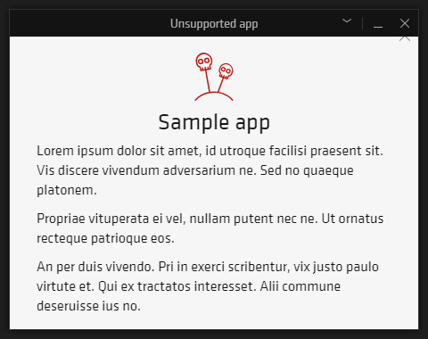

Behavior is different depending on window type, and we're going to go over two main types of Overwolf app windows: Transparent vs. Non-Transparent Windows.

##  Non-Transparent Window

A non-Transparent Window is the **standard** Overwolf window. A window with borders, control buttons and opacity slider.  

 * Any part of your window that has a transparent background ("background: transparent;") will become white.
 
#### Example from the manifest.json:

* In order to create this window you should set the [transparent](../api/manifest-json#window-transparent) property in your manifest.json to 'false'.
* In order to enable a [maximize](../api/manifest-json#show_maximize) / [minimize](../api/manifest-json#windows-show_minimize) buttons, you should set the right flags in the manifest to "true".

```json
"windows": {
    "windowName": {
      "file": "name.html",
      "transparent": false,
      "show_maximize": true, //only relevant for non-transparent windows
      "show_minimize": true //only relevant for non-transparent windows
     }
}
```

Example for a standard, non-transparent window:



## Transparent window

:::important
The term transparent might be a bit misleading. This window has no borders, window control buttons or default background – create those elements by yourself in your HTML/CSS.
:::

A Transparent Window is a window **without** borders, control buttons and opacity slider.  

* Any part of your window that has a transparent background ("background: transparent;") will become a see-through area that blends with the game or desktop behind it.
* You should implement the window header with the control elements (like maximize, minimize) independently, by yourself in the HTML/CSS. (you can use our [UI components samples](../start/sample-app-ui-components))
* You should implement dragging behavior independently, by yourself. (you can use our [sample app](../start/sample-app-overview) that already implemented this feature)

#### Example from the manifest.json:

* In order to create this window you should set the [transparent](../api/manifest-json#window-transparent) property in your manifest.json to 'true'.

```json
"windows": {
    "windowName": {
      "file": "name.html",
      "transparent": true
     }
}
```

Here you can see some examples for transparent windows:

<div class="box" data-slick='{"variableWidth": true}'>
  <a data-fancybox="gallery1" data-caption="transparent window sample app" href="../assets/transparent-window.png">
  "transparent" window that is being used in our sample app. 
    <span class="thumb">
      
    </span>
  </a>
  <a data-fancybox="gallery1" data-caption="1366×775 Window size" href="../assets/transparent-overwolf-window-2.jpg">
  “transparent” window that is being used in the Spawning Tool Build Advisor. 
    <span class="thumb">
      
    </span>
  </a>
  <a data-fancybox="gallery1" data-caption="1680×980 Window size" href="../assets/transparent-overwolf-window-3.jpg">
  “transparent” window being used in the Legendary Builds app
    <span class="thumb">
      
    </span>
  </a>
</div>

## Native window

If your app includes a window that will only be visible on desktop but not while playing (desktop_only:true), you should define this window as a ["native"](../api/manifest-json#native_window).  

It will dramatically improve your app performance and help design an efficient, elegant product.

* A native window is always a non-transparent window.
* Any part of your window that has a transparent background ("background: transparent;") will become black.
* You should implement the window header with the control elements (like maximize, minimize) independently, by yourself in the HTML/CSS.

#### Example from the manifest.json:

add the following flags to that window's data in the app’s manifest.json file:

```json
"desktop_only": true,
"native_window":true,
```

## Comparison table

To summarize, these are the main differences between the transparent, non-transparent, and native windows:

Feature                    | transparent              | non-transparent                | native                       |
-------------------------- | -------------------------| ------------------------------ |------------------------------|
desktop_only support       | +                        | +                              | +                            |
in_game_only support       | +                        | +                              | -                            |
built-in controls (maximize,minimize)         | -     | +                              | -                            |
built-in dragging          | -                        | +                              | -                            |
See-through background     | +                        | - (white bg)                   | - (black bg)                 |

## Sample app

You should download our [sample app](../start/sample-app-overview), it covers transparent/non-transparent window creation and much more.